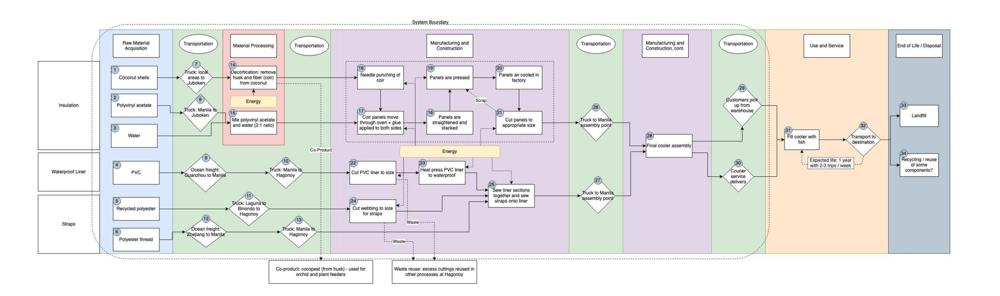

# Fortuna-Cools-Life-Cycle-Assessment
Stanford team and Fortuna team worked together and conducted a formal life cycle assessment of Fortuna coolers ([Poster](https://github.com/J-i-n-p-u/Fortuna-Cools-Life-Cycle-Assessment/blob/main/Poster.pdf), [Report](https://github.com/J-i-n-p-u/Fortuna-Cools-Life-Cycle-Assessment/blob/main/Fortuna%20Cools%20Life%20Cycle%20Assessment%20Report.pdf), [LCA model](https://github.com/J-i-n-p-u/Fortuna-Cools-Life-Cycle-Assessment/raw/main/LCA%20Model.xlsx))

## Description
Fortuna Cools (Fortuna) was founded in 2018 with the goal of creating an affordable and environmentally sustainable option for coolers for fishermen. To date, they have operated in the Philippines, producing coolers made in large part of coconut husk, a common waste product. The coolers are intended as an alternative for expanded polystyrene (EPS) coolers with a usable life of just two weeks, or as alternatives to reusable polyurethane coolers that are often too expensive to be a feasible option for fishermen. Stanford team and Fortuna team worked together and conducted a formal life cycle assessment of Fortuna coolers. We determined that the Fortuna cooler life cycle is associated with drastically lower greenhouse gas emissions and is comparable to or has slightly higher emissions than EPS coolers in several impact categories. The capability of coconut husks to be degraded and converted into a biodegradable compost and fertilizer minimizes the energy requirement towards the end-of-life disposal; the ability to compost the Fortuna cooler provides additional benefit over EPS.
